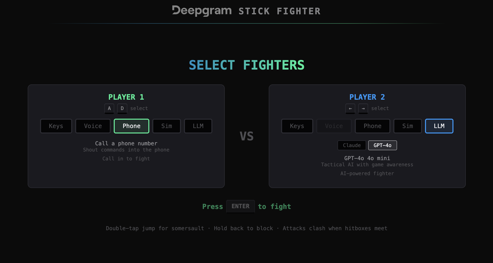
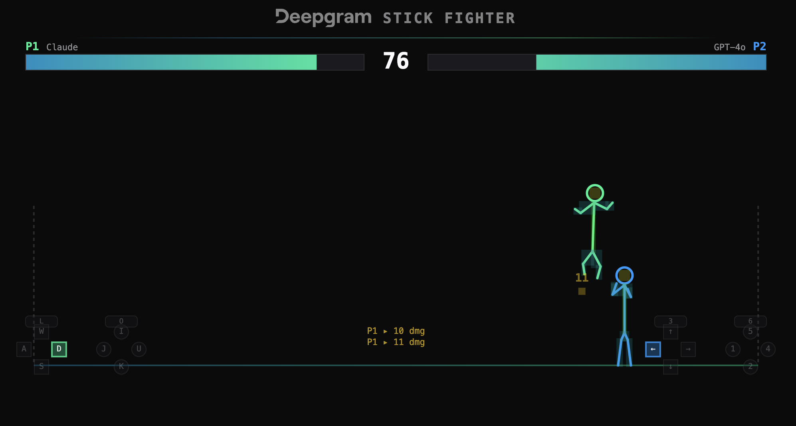

# Stick Fighter

A Deepgram-branded 2D fighting game with stick figure fighters, built with HTML5 Canvas and a Python backend. Five input modes let players fight using keyboard controls, voice commands, phone calls, random bots, or tactical AI.





## Features

### Input Modes

| Mode | How it works |
|------|-------------|
| **Keys** | Keyboard controls — WASD + UIO/JKL for P1, arrows + numpad for P2 |
| **Voice** | Shout commands into your mic — Deepgram Flux v2 STT with interim transcript action detection for minimum latency. Fighter personality reacts via Anthropic LLM + Deepgram TTS |
| **Phone** | Call a Twilio number to fight — audio streams through the server to Deepgram STT. Phone number displayed on HUD until the call connects |
| **Sim** | Random weighted command bot — lightweight, no API keys needed |
| **LLM** | Tactical AI fighter — sends game state to Anthropic Claude Haiku 4.5 or OpenAI GPT-4o mini, receives 5-move plans, executes at 1 move/sec with effectiveness tracking |

Any combination works — pit Claude against GPT-4o, voice against keyboard, or phone against LLM.

### Combat System

- **6 attack types**: light/medium/heavy punch and kick, each with different speed, damage, and range
- **Hit zones**: head (2x damage), crotch (3x), body (1x), limbs (0.5x)
- **Mechanics**: blocking, dashing, double-jumping, somersaults (max 2 per airtime), attack clashes
- **99-second rounds** with health bars, damage log, and SNES-style controller overlays

### Tech Stack

- **Frontend**: Pure HTML/JS with Canvas rendering — no bundler, browser-native ES modules
- **Backend**: Python with [Litestar](https://litestar.dev/) (ASGI) + uvicorn
- **STT**: [Deepgram Flux v2](https://developers.deepgram.com/docs/flux) — real-time conversational speech recognition
- **TTS**: [Deepgram Aura 2](https://developers.deepgram.com/docs/tts) — voice personality responses
- **LLM**: Anthropic Claude Haiku 4.5 / OpenAI GPT-4o mini — tactical fight planning
- **Phone**: Twilio Media Streams — call-in voice control via Deepgram STT

## Setup

### Prerequisites

- Python 3.11+
- [uv](https://docs.astral.sh/uv/) (Python package manager)

### Install dependencies

```sh
uv sync
```

### Configure environment variables

Copy the example and fill in your keys:

```sh
cp .env.example .env
```

| Variable | Required | Description |
|----------|----------|-------------|
| `DEEPGRAM_API_KEY` | Yes | [Deepgram API key](https://console.deepgram.com/) — powers STT and TTS |
| `ANTHROPIC_API_KEY` | For LLM/Voice modes | [Anthropic API key](https://console.anthropic.com/) — Claude Haiku 4.5 |
| `OPENAI_API_KEY` | For LLM mode (GPT-4o) | [OpenAI API key](https://platform.openai.com/) — GPT-4o mini |
| `TWILIO_PHONE_NUMBERS` | For Phone mode | Comma-separated Twilio numbers (e.g. `+15551234567,+15551234568`) |
| `BASE_URL` | For Phone mode | Public URL for Twilio webhooks (e.g. ngrok URL) |

**Minimum for keyboard-only play**: no env vars needed.
**Minimum for voice mode**: `DEEPGRAM_API_KEY` + `ANTHROPIC_API_KEY`.
**Minimum for LLM mode**: `DEEPGRAM_API_KEY` + `ANTHROPIC_API_KEY` and/or `OPENAI_API_KEY`.

### Run

```sh
uv run uvicorn server:app --reload --port 3000
```

Open http://localhost:3000

### Phone mode setup

Phone mode requires Twilio numbers and a publicly accessible server:

1. Get two phone numbers from [Twilio](https://console.twilio.com/)
2. For local development, run [ngrok](https://ngrok.com/): `ngrok http 3000`
3. Set `BASE_URL` to the ngrok URL in `.env`
4. Configure each Twilio number's **Voice webhook** to `{BASE_URL}/api/twilio/incoming` (HTTP POST) in the Twilio console
5. Add the numbers to `TWILIO_PHONE_NUMBERS` in `.env`

## Architecture

```
Browser                          Server (Python/Litestar)              External
──────                          ────────────────────────              ────────

index.html ──── /src/*.js        server.py
    │                                │
    ├─ Keyboard ─────────────────────┤
    │   (local, no server)           │
    │                                │
    ├─ Voice ── WS /ws/stt ──────────┼──── Deepgram Flux v2 STT
    │           POST /api/voice/llm ─┼──── Anthropic Claude
    │           POST /api/voice/tts ─┼──── Deepgram Aura 2 TTS
    │                                │
    ├─ Phone ── SSE /api/phone/* ────┼──── Twilio Media Streams
    │                                │         └── Deepgram Flux v2 STT (mulaw/8kHz)
    │                                │
    ├─ Sim ──── SSE /api/session/* ──┤
    │           (random commands)    │
    │                                │
    └─ LLM ──── POST /api/llm/* ────┼──── Anthropic Claude Haiku 4.5
                                     └──── OpenAI GPT-4o mini
```

### Key Files

| File | Purpose |
|------|---------|
| `server.py` | Backend — STT proxy, LLM endpoints, TTS, Twilio bridge, SSE sessions |
| `index.html` | HTML page with onboarding UI, CSS design tokens, canvas element |
| `src/input.js` | Abstract input system — Actions enum, InputManager, KeyboardAdapter, CommandAdapter |
| `src/fighter.js` | Fighter class — physics, state machine, skeleton rendering, hit zones |
| `src/game.js` | Game loop — stage, hit detection, HUD, controller overlays, damage log |
| `src/main.js` | Entry point — mode selection, adapter wiring, fight lifecycle |
| `src/voice.js` | VoiceAdapter — mic audio to Deepgram STT with fighter personality |
| `src/phone.js` | PhoneAdapter — Twilio call-in via server-side STT bridge |
| `src/llm.js` | LLMAdapter — tactical AI with 5-move plans and effectiveness tracking |
| `src/simulated.js` | SimulatedAdapter — random weighted commands for testing |
| `src/sfx.js` | Sound effects — pre-decoded MP3 AudioBuffers with random variants |
| `src/ui.js` | Design token bridge — reads CSS vars for canvas, mode selection helpers |

## Controls

### Keyboard (P1)

| Keys | Action |
|------|--------|
| W A S D | Move (up/left/down/right) |
| U I O | Light / medium / heavy punch |
| J K L | Light / medium / heavy kick |
| Double-tap A or D | Dash |
| W W (double-tap) | Somersault |

### Keyboard (P2)

| Keys | Action |
|------|--------|
| Arrow keys | Move |
| 4 5 6 (numpad) | Light / medium / heavy punch |
| 1 2 3 (numpad) | Light / medium / heavy kick |

### Voice / Phone Commands

Shout any combination: `"forward"`, `"jump"`, `"heavy kick"`, `"dash forward"`, `"crouch heavy punch"`, `"jump forward heavy kick"`, etc.

## License

MIT
